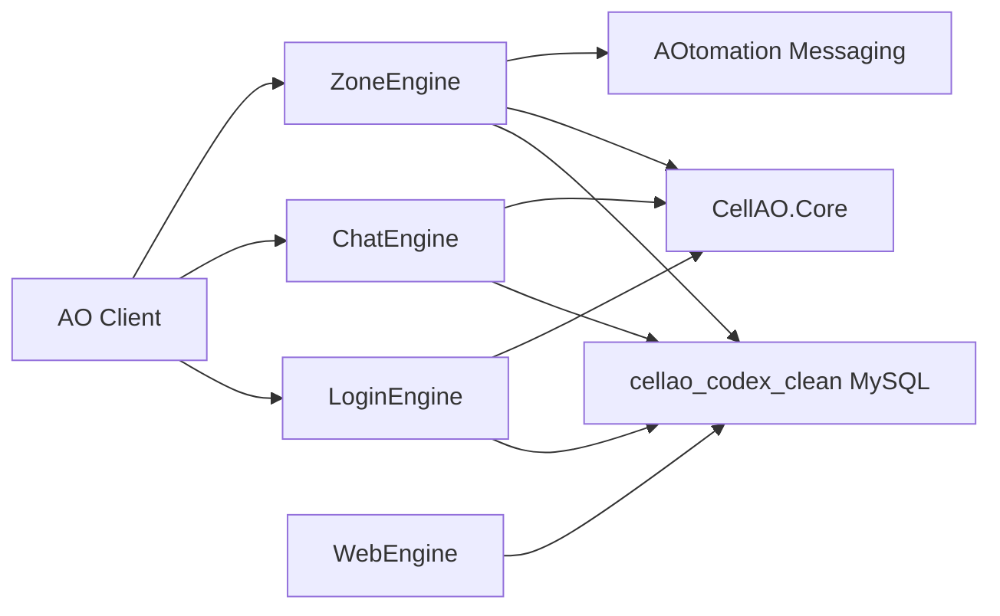
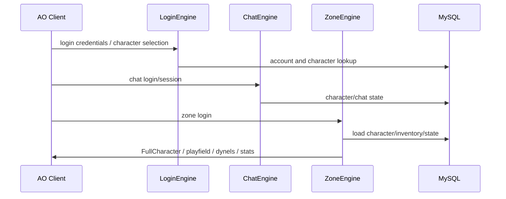
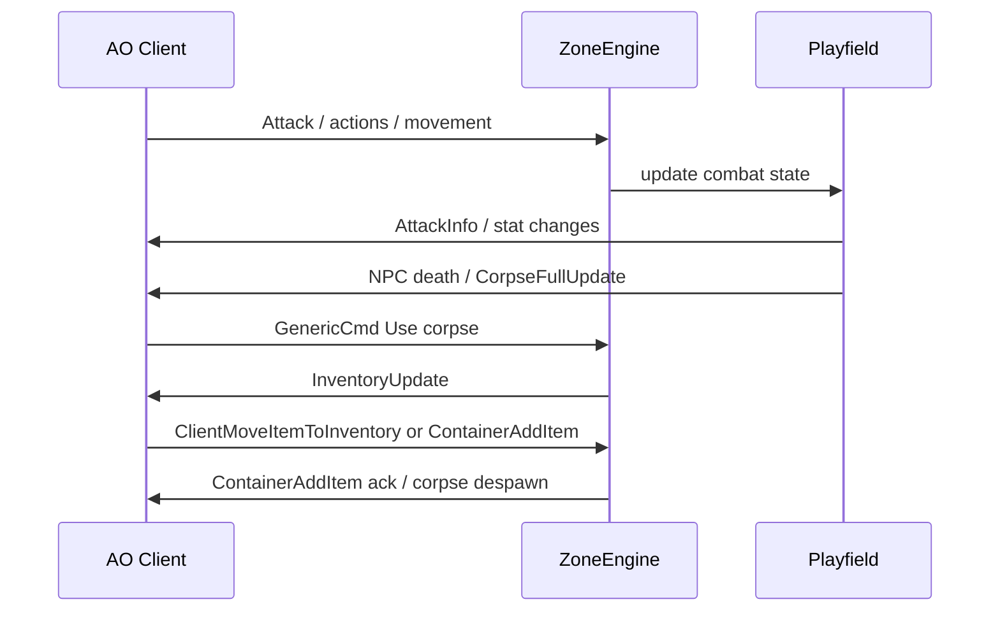
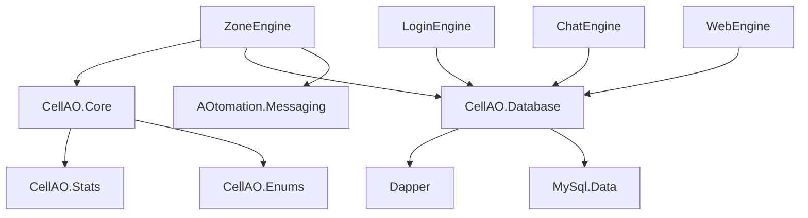

# Architecture

Generated: 2026-06-02

## System Architecture

CellAO is split into console engines plus shared libraries:



## Major Subsystems

- Login: credentials, character list, character creation, selected character handoff.
- Chat: chat sessions, tells, channels, buddy/org structures.
- Zone: playfield entry, character state, movement, combat, inventory, equipment, trade, NPCs, corpses, loot, stat updates, commands, teleporting, and packet responses.
- Core: entities, dynels, characters, inventory pages, items, requirements, functions, vectors, playfields, NPC/vendor handling.
- Database: DAO/entity layer for accounts, characters, items, templates, mobs, loot, and related persisted data.
- Messaging: AOtomation N3 messages and serializers.
- Tools: capture, replay, smoke tests, client hook/injector experiments, and historical utilities.

## Data Flow

Typical login/playfield flow:



Typical combat/loot flow:



## Class And Module Structure

Important files and directories:

- `CellAO/Libraries/Source/CellAO.Core/Entities/Dynel.cs`: base dynamic entity.
- `CellAO/Libraries/Source/CellAO.Core/Entities/Character.cs`: character model.
- `CellAO/Libraries/Source/CellAO.Core/Inventory`: inventory pages and item movement models.
- `CellAO/Server/ZoneEngine/Core/Controllers/PlayerController.cs`: player runtime controller.
- `CellAO/Server/ZoneEngine/Core/Controllers/NPCController.cs`: NPC runtime controller and movement/combat behavior.
- `CellAO/Server/ZoneEngine/Core/Playfields/Playfield.cs`: playfield entity registry, combat, death, corpse, loot, despawn, and broad gameplay flow.
- `CellAO/Server/ZoneEngine/Core/MessageHandlers`: N3 message handlers for zone gameplay.
- `CellAO/Server/ZoneEngine/Core/Packets`: custom packet builders.
- `CellAO/Server/ZoneEngine/ChatCommands`: GM/debug command surface.
- `CellAO/Libraries/Source/AOtomation/AOtomation.Messaging`: message models and serializer contracts.

## Networking Architecture

The project uses N3/AOtomation message models for client/server packet flow. Important packet families from current work:

- `Action = 0x2049527C`
- `Attack = 0x28494070`
- `CharacterAction = 0x5E477770`
- `ContainerAddItem = 0x47537A24`
- `InventoryUpdate = 0x4E536976`
- `InventoryUpdated = 0x485E7202`
- `SimpleItemFullUpdate = 0x3B11256F`
- `TemplateAction = 0x35505644`
- `WeaponItemFullUpdate = 0x3B1D2268`

Packet repairs must distinguish:

- AOtomation model shape.
- Captured runtime envelope shape.
- AO stripdown recovered subclass body.
- Current-client live behavior.

## Database Architecture

The local configuration is MySQL and must use only `cellao_codex_clean`. The project includes DAO/entity code under `CellAO/Libraries/Source/CellAO.Database`. Do not infer schema safety from code alone; data mutation requires explicit project-owner approval when destructive or broad.

## Asset Pipeline

The repo contains logos, XML data files, documentation generated from enums/stats, and tooling. Client assets come from the installed AO client and external reverse-engineered sources. There is no fully documented build-time asset pipeline in the checked files.

TODO: Requires human clarification for the intended final asset/data generation pipeline.

## UI Architecture

The project itself has console engines and no modern app UI. AO client UI behavior is driven by packet responses. Player trade windows, loot windows, equipment visuals, death screen behavior, and NPC movement visuals are client UI effects triggered by server packet flow.

## Build Architecture

Primary build:

```powershell
& 'C:\Program Files\Microsoft Visual Studio\18\Community\MSBuild\Current\Bin\MSBuild.exe' 'CellAO\CellAO.sln' /t:Build /p:Configuration=Debug /m
```

The solution includes server engines, shared libraries, AOtomation, msgpack-cli, and utility projects. Some tools under `tools-temp` are separate projects and are not necessarily part of the main solution.

## Dependency Graph

High-level dependency direction:



## Architectural Concerns

- `Playfield.cs` is a large god object and owns many unrelated systems.
- Packet behavior is split across AOtomation models, handlers, and custom packet builders.
- Some current-client packet contracts differ from old CellAO assumptions.
- Movement and NPC behavior need capture/replay validation before more runtime edits.
- Tests are mostly smoke/source assertions; they are useful but not full simulation coverage.

