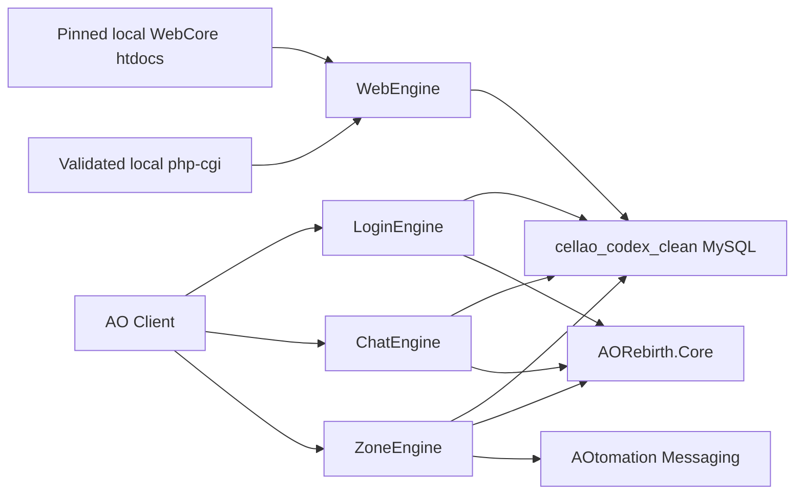
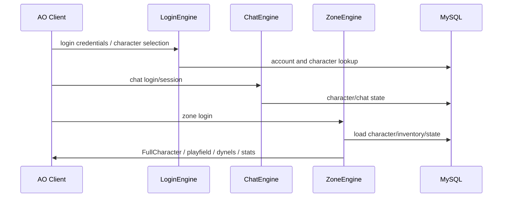
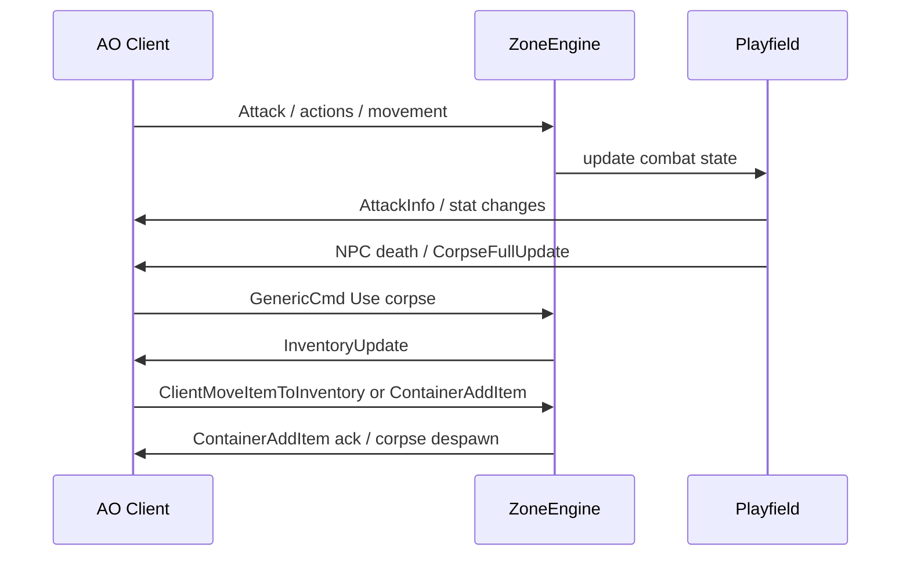
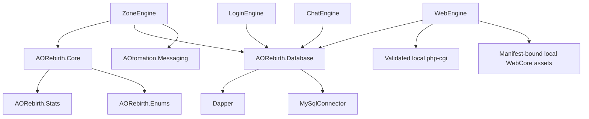

# Architecture

Generated: 2026-06-02

## System Architecture

AO Rebirth is split into console engines plus shared libraries:



## Major Subsystems

- Login: credentials, character list, character creation, selected character handoff.
- Chat: chat sessions, tells, channels, buddy/org structures.
- Zone: playfield entry, character state, movement, combat, inventory, equipment, trade, NPCs, corpses, loot, stat updates, commands, teleporting, and packet responses.
- Core: entities, dynels, characters, inventory pages, items, requirements, functions, vectors, playfields, NPC/vendor handling.
- Database: DAO/entity layer for accounts, characters, items, templates, mobs, loot, and related persisted data.
- Messaging: AOtomation N3 messages and serializers.
- Tools: capture, replay, smoke tests, client hook/injector experiments, and historical utilities.

## Data Flow

Typical login/playfield flow:



Typical combat/loot flow:



## Class And Module Structure

Important files and directories:

- `AORebirth/Libraries/Source/AORebirth.Core/Entities/Dynel.cs`: base dynamic entity.
- `AORebirth/Libraries/Source/AORebirth.Core/Entities/Character.cs`: character model.
- `AORebirth/Libraries/Source/AORebirth.Core/Inventory`: inventory pages and item movement models.
- `AORebirth/Server/ZoneEngine/Core/Controllers/PlayerController.cs`: player runtime controller.
- `AORebirth/Server/ZoneEngine/Core/Controllers/NPCController.cs`: NPC runtime controller and movement/combat behavior.
- `AORebirth/Server/ZoneEngine/Core/Navigation/`: global hostile-NPC chase capability, bounded route planning/following, route lifecycle state, and playfield navigation-provider contract. PF127 is the first provider; see `docs/project/NPC_CHASE_NAVIGATION.md`.
- `AORebirth/Server/ZoneEngine/Core/Playfields/OrdinaryEnemyProfile.cs`, `OrdinaryEnemyCatalog.cs`, and `OrdinaryEnemyRuntimeService.cs`: validated ordinary-enemy type/spawn data and the single shared runtime path. See `docs/project/ORDINARY_ENEMY_RUNTIME.md`.
- `AORebirth/Server/ZoneEngine/Core/Playfields/Playfield.cs`: playfield entity registry, combat, death, corpse, loot, despawn, and broad gameplay flow — **do not add new system ecosystems here**; extract to `Core/<System>/` (see `docs/project/SUBSYSTEMS.md`).
- `AORebirth/Server/ZoneEngine/Core/Mail/`: Mail Terminal runtime + handler subsystem.
- `AORebirth/Server/ZoneEngine/Core/Arete/`: Arete dialogue/quest subsystem.
- `AORebirth/Server/ZoneEngine/Core/MessageHandlers`: N3 message handlers for zone gameplay (handlers may also live inside a subsystem folder).
- `AORebirth/Server/ZoneEngine/Core/Packets`: custom packet builders.
- `AORebirth/Server/ZoneEngine/ChatCommands`: GM/debug command surface.
- `AORebirth/Libraries/Source/AOtomation/AOtomation.Messaging`: message models and serializer contracts.

## Networking Architecture

The project uses N3/AOtomation message models for client/server packet flow. Important packet families from current work:

- `Action = 0x2049527C`
- `Attack = 0x28494070`
- `CharacterAction = 0x5E477770`
- `ContainerAddItem = 0x47537A24`
- `InventoryUpdate = 0x4E536976`
- `InventoryUpdated = 0x485E7202`
- `SimpleItemFullUpdate = 0x3B11256F`
- `TemplateAction = 0x35505644`
- `WeaponItemFullUpdate = 0x3B1D2268`

Packet repairs must distinguish:

- AOtomation model shape.
- Captured runtime envelope shape.
- AO stripdown recovered subclass body.
- Current-client live behavior.

## Database Architecture

The local configuration is MySQL and must use only `cellao_codex_clean`. The project includes DAO/entity code under `AORebirth/Libraries/Source/AORebirth.Database`. Do not infer schema safety from code alone; data mutation requires explicit project-owner approval when destructive or broad.

## Asset Pipeline

The repo contains logos, XML data files, documentation generated from enums/stats, and tooling. Client assets come from the installed AO client and external reverse-engineered sources. There is no single build-time pipeline for all of these assets.

Optional WebEngine has two offline, fail-closed supply boundaries. The PHP
boundary pins an official PHP 8.5.9 Windows x64 NTS VS17 archive, full file
inventory, AORebirth `php.ini`, runtime probes, and a process-lifetime lease.
The content boundary pins the exact CellAO WebCore commit
`765c3850767b63af1cd259bab7f2f7ca3e97adf9`, validates its untouched 7,140-file
base tree, applies seven exact input-hash-bound compatibility operations, and
validates a complete final 7,140-file manifest before activation. Runtime
startup downloads or updates neither dependency. `WebRequestPathPolicy` exposes
only four public PHP routes and allowlisted static extensions; historical
admin/internal/authentication/mutation routes fail closed. See
`docs/project/WEBCORE_ASSET_SUPPLY.md` and
`docs/project/PHP_RUNTIME_SUPPLY.md`.

## UI Architecture

The project itself has console engines and no modern app UI. AO client UI behavior is driven by packet responses. Player trade windows, loot windows, equipment visuals, death screen behavior, and NPC movement visuals are client UI effects triggered by server packet flow.

## Build Architecture

Primary build:

```cmd
cmd /d /c tools\build_aorebirth_debug.cmd
```

The standard validation wrapper verifies required package folders before MSBuild, runs explicit MSBuild solution restore only when package folders are missing, then builds `AORebirth.Core`, `ZoneEngine`, the read-only `DatabasePreflight`, and `WebEngine` with single-node MSBuild (`/m:1`) and node reuse disabled (`/nr:false`). Legacy build-time NuGet restore through `.nuget\NuGet.targets` has been removed from project files. PowerShell and `.ps1` wrappers are implementation details behind approved CMD lifecycle entrypoints and are not invoked directly by Codex. The solution includes server engines, shared libraries, AOtomation, msgpack-cli, and utility projects. Some tools under `tools-temp` are separate projects and are not necessarily part of the main solution.

## Dependency Graph

High-level dependency direction:



## Architectural Concerns

- `Playfield.cs` is a large god object and owns many unrelated systems.
- Packet behavior is split across AOtomation models, handlers, and custom packet builders.
- Some current-client packet contracts differ from old AO Rebirth assumptions.
- Movement and NPC behavior need capture/replay validation before more runtime edits.
- Tests are mostly smoke/source assertions; they are useful but not full simulation coverage.
- WebEngine remains optional and development-only. PHP 8.5.9 identity,
  configuration, CGI execution, required modules, deterministic WebCore repairs,
  and all PHP syntax are validated; live database semantics, HTTPS transport,
  and upstream redistribution rights remain unproven.

## Hostile NPC Chase Navigation

The global navigation boundary is `ZoneEngine.Core.Navigation`, not an enemy or playfield content profile. Existing combat policy requests pursuit through `PlayfieldNpcCombatMovementRuntimeService`; `NpcChaseNavigationRuntimeService` chooses direct movement, a cached provider route, or a fail-closed hold. `IPlayfieldChaseNavigationProvider` supplies authoritative segment checks and route generation without exposing PF127 details to combat code. Valid destinations continue through `NPCController.MoveTo`, preserving server movement cadence and client synchronization.

PF127/resource `127` is currently the only supported provider. It derives a bounded same-elevation grid from the promoted collision geometry and validates every segment against that geometry. Other playfields explicitly remain unsupported and preserve legacy direct chase. See `docs/project/NPC_CHASE_NAVIGATION.md` for exact limits, failure behavior, lifecycle cleanup, validation, and the provider-adoption process.
