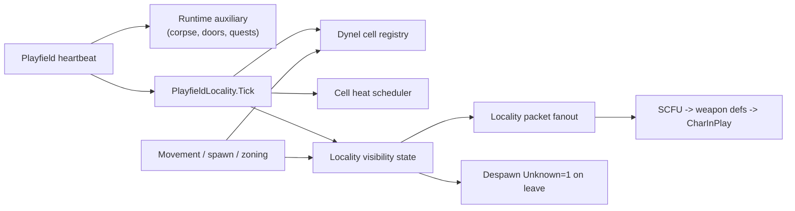

# Playfield Locality Architecture

## Status

AORebirth uses a **playfield-owned cell locality system** for dynamic character visibility and simulation scheduling. It replaces the legacy radius-based visibility-interest stack (uniform spatial index, enter/leave radii, and `PlayfieldVisibilityInterest*` services).

Visibility is **cell-neighbor driven** (Chebyshev rings). Simulation uses **tiered cell heat** (Hot / Warm / Cold / Asleep). Packet shapes and ordering are unchanged.



## Ownership

| Component | Owner |
| --- | --- |
| `PlayfieldLocality` (orchestrator) | `Playfield` |
| Visibility reconcile + bidirectional state | `PlayfieldLocalityVisibility` |
| Cell registration / neighbor queries | `PlayfieldDynelCellRegistry` |
| Heat-tier tick scheduling | `PlayfieldCellHeatScheduler` |
| SCFU / CharInPlay sequencing | `PlayfieldLocalityPackets` |
| Packet sequencing + fanout helpers | `PlayfieldRuntimeSystems` (`VisibilityFanout`, `PacketSequences`) |
| Corpse lifecycle, doors, vendors | `PlayfieldRuntimeSystems` (auxiliary heartbeat only) |

Locality logic does **not** live in `PlayfieldRuntimeSystems`. The playfield heartbeat calls `ProcessHeartbeatAuxiliary` for non-locality work, then `locality.Tick(deltaTime)` for cell scheduling and character ticks.

Source root: `AORebirth/Server/ZoneEngine/Core/Playfields/Locality/`.

## Cell Layout

`PlayfieldCellLayoutFactory` chooses a layout per playfield instance from `Playfield.MetaData`, the parsed `GameData/Playfields/{id}/metadata.json` produced by the RDB tilemap extractor. `Playfields.xml` is no longer consulted for grid geometry.

Metadata is loaded once per playfield id by `ZoneEngine.Core.GameData.GameDataLoader` from `{BaseDirectory}\GameData`. A missing GameData root fails at engine startup; a missing per-playfield folder is a normal "no ground tilemap" signal and yields `null` metadata; a corrupt or schema-invalid document throws.

### Outdoor grid

Used when the tilemap is chunked ground (`"tilemapFormat": "CHGA"`) and the chunk grid covers the heightmap:

| Derived value | Source |
| --- | --- |
| `numZonesX`, `numZonesZ` | `gridWidth` (the chunk grid is square) |
| `cellWorldSize` | `chunkSize * tileSize` |

World X/Z map to cell indices via `floor(coord / cellWorldSize)`. Cell ID is `(iz * numZonesX) + ix`. Neighbor collection uses **Chebyshev distance** (square rings).

Coordinates outside the grid yield cell ID `-1` (non-local).

### Indoor / unconfigured fallback

`IndoorCellLayout` is used when:

- the playfield has no `metadata.json` (indoor dungeons, mission instances, private cities), or
- the tilemap is embedded ground (`"tilemapFormat": "GNDA"`), which carries no chunk grid, or
- `chunkSize`, `gridWidth`, or `tileSize` are missing or non-positive, or the chunk grid does not cover `width`

Indoor behavior:

- **Visibility** — all registered characters in the playfield are candidates (minus self).
- **Simulation** — every registered character ticks at full playfield rate on every heartbeat.

## Configuration

Global policy is loaded from `Config.xml` → `<Locality>` (`Utility.Config.LocalitySettings`).

| Setting | Default | Meaning |
| --- | ---: | --- |
| `EnableCellHeatScheduling` | `false` | Enables reduced-rate and sleeping character ticks. Leave disabled until scheduler combat and lifecycle regression gates pass. Visibility locality remains active either way. |
| `VisibilityNeighborLevel` | 2 | Chebyshev ring for AOI candidate selection |
| `HotNeighborLevel` | 1 | Cells at or inside this distance from a connected player tick at full PF rate |
| `WarmNeighborLevel` | 2 | Cells beyond Hot but inside this distance tick at half PF rate |
| `CellSleepTime` | 30 | Seconds a cell must remain Cold before becoming Asleep (no tick) |

`PlayfieldLocalityPolicy.FromConfig` clamps invalid combinations (e.g. `hot > warm`, `warm > visibility`) back toward defaults.

Example:

```xml
<Locality>
  <EnableCellHeatScheduling>false</EnableCellHeatScheduling>
  <VisibilityNeighborLevel>2</VisibilityNeighborLevel>
  <HotNeighborLevel>1</HotNeighborLevel>
  <WarmNeighborLevel>2</WarmNeighborLevel>
  <CellSleepTime>30</CellSleepTime>
</Locality>
```

There are no environment-variable radius overrides. Distance is expressed in **cell neighbor levels**, not world meters.

## Visibility (AOI)

### Candidate selection

For outdoor playfields, a recipient's candidates are all characters in cells within `VisibilityNeighborLevel` Chebyshev distance of the recipient's cell. Indoor playfields enumerate all registered characters.

There is no enter/leave radius hysteresis. Visibility changes when cell membership or neighbor topology changes.

### Bidirectional state

`PlayfieldLocalityVisibility` stores:

- visible sources by recipient;
- visible recipients by source.

Reconcile runs on visibility refresh and updates both directions. Leave transitions only target clients that previously received the source.

### Movement-driven refresh

`Playfield.RefreshCharacterVisibility(character, forceRefresh)` updates the dynel cell registry and reconciles AOI **only when**:

- the character's cell ID changed, or
- `forceRefresh: true` (teleport, death respawn, dungeon wing changes, combat visibility repair, team warp).

Ordinary movement (`CharDCMove`, `SetPos`, follow) uses the default `forceRefresh: false`. When a mover crosses a cell boundary, reconcile updates who can see the mover and what the mover can see. Stationary recipients do not need their own refresh when someone else enters their neighborhood.

### Pinned visibility

Some relationships bypass normal leave logic:

| Pin | Rule |
| --- | --- |
| Pets | Source `petmaster` stat matches recipient identity instance |
| Nascence D1–D4 living NPCs | All living NPCs pinned for players in those dungeon playfields |
| Mission instances | Neighborhood check applies; pins follow mission-instance playfield rules |

Forced visibility (`ForceCharacterVisibilityToRecipient`) still exists for Havaris boss buttons and mid-fight repair paths.

## Simulation Heat

`PlayfieldCellHeatScheduler` assigns a heat tier to each populated outdoor cell each heartbeat.

| Tier | Tick rate | Promotion |
| --- | --- | --- |
| **Hot** | Every heartbeat (full PF rate) | Connected player within `HotNeighborLevel`, or cell contains a fighting NPC (`FightingTarget != None`, `NPCController`, alive) |
| **Warm** | Every other heartbeat | Player within `WarmNeighborLevel` but not Hot |
| **Cold** | 1 Hz | No player within `WarmNeighborLevel` |
| **Asleep** | None | Cold for `CellSleepTime` seconds |

Combat-hot follows the **fighter's current cell** — when a fighting NPC moves, its new cell is promoted on the next tick. Neighbor cells are not pre-heated for combat.

Indoor playfields skip heat tiers; all characters receive full-rate ticks.

### Heartbeat tick path

`PlayfieldLocality.Tick`:

1. `PlayfieldCellLocalityMonitor` tracks player-occupied cells (surface loading placeholder hook).
2. With `EnableCellHeatScheduling=false`, every character invokes `ProcessDynelTick` once per heartbeat using the full heartbeat delta.
3. With `EnableCellHeatScheduling=true`, `PlayfieldCellHeatScheduler` resolves heat and invokes `ProcessDynelTick` per character in tickable cells.
4. `ProcessDynelTick` runs character tick, NPC patrol, follow, and player collision via `PlayfieldLocalityTickCallbacks` wired from `Playfield`.

## Lifecycle Semantics

| Lifecycle | Behavior |
| --- | --- |
| Initial player snapshot | Synchronize registry, select cell-neighbor candidates, send SCFU → weapons → CharInPlay, mark recipient initialized |
| Player/NPC movement | Cell registry updated on move; AOI reconcile only on cell change (unless forced) |
| Ordinary/captured NPC spawn | Register cell + shared spawned-character visibility hook |
| Pet spawn | Owner-direct summon packets unchanged; observers use shared hook with owner pre-marked visible |
| Character-scoped messages | Fanout to `VisibleRecipientsForSource` plus source client |
| Corpse appearance | `CorpseFullUpdate` to recipients sharing visibility neighborhood with corpse source |
| Corpse / character despawn | `DespawnMessage` to tracked recipients, then unregister visibility + cell |
| Teleport / zoning / death respawn | `forceRefresh: true` visibility reconcile |
| Disconnect | `ForgetVisibilityRecipient` + dynel unregister |
| Playfield reset | `locality.Clear()` + runtime auxiliary clear |
| Static dynels / vendors | Unchanged; outside locality AOI |

## Packet Invariants

Character visibility entry order is unchanged:

1. `SimpleCharFullUpdate`
2. Zero or more observer `WeaponItemFullUpdate` definitions
3. `CharInPlay`

Leave and removal use `DespawnMessage` (N3 `0x36510078`, `Unknown=1`). Locality changes **recipients only**; packet bodies are unchanged.

Guardian pets and Havaris bosses retain specialized SCFU wire paths inside `PlayfieldLocalityPackets`.

## Diagnostics

Subway visibility diagnostic snapshots (`SubwayVisibilitySnapshotDiagnostics`) still record SCFU, weapon-definition, and CharInPlay ledgers during snapshot fanout. `PlayfieldLocalityVisibility.LastCandidateCount` reports the most recent outdoor candidate inspection size.

Spawn diagnostic selectors (`NONE`, `SUPPORTED_29`, `ORDINARY_9`, etc.) control spawn eligibility only. They do not bypass cell-neighbor AOI selection.

## Surface Loading (placeholder)

`PlayfieldCellResourceHub` + `PlaceholderCellSurfaceLoader` track which cells should have resources loaded based on player proximity (`HotNeighborLevel` ring). This is a stub for future collision/nav mesh chunk streaming; v1 does not load RDB tilemaps.

## Removed Legacy Components

The following are deleted and must not be reintroduced:

- `PlayfieldVisibilityInterestRuntimeService`
- `PlayfieldVisibilityInterestState`
- `PlayfieldVisibilityInterestPolicy`
- `PlayfieldVisibilityPacketRuntimeService`
- `UniformSpatialIndex`
- `PlayfieldSpatialCharacterIndex`

Radius-based enter/leave policy and `AO_REBIRTH_VISIBILITY_*` environment variables are obsolete.

## Rollout Notes

1. **Extract playfield GameData** with `extract-rdb-gamedata.bat` so `GameData/Playfields/{id}/metadata.json` exists. Playfields without chunked ground metadata run indoor fallback (full visibility + full tick).
2. **Tune `<Locality>`** globally before adding per-playfield overrides (not implemented in v1).
3. **Validate with live capture** at cell boundaries — pop-in/out behavior differs from the old 80 m / 100 m hysteresis model.
4. **Tests** — lifecycle trace tests under `SmokeLounge.AOtomation.Messaging.Tests` still reference removed interest symbols and need updating to locality assertions.
