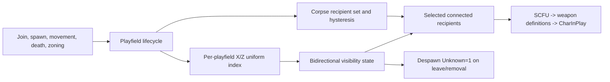

# Visibility Interest Architecture

## Status

AORebirth now uses one global, playfield-owned visibility-interest runtime for dynamic characters. It replaces unbounded character snapshots and character-scoped playfield fanout with bounded X/Z selection while preserving the established packet shapes and ordering.

This is a server visibility repair. It is separate from the client-side RoomSpace guard and from ordinary-enemy profile/spawn data. The 38 PF127 rows from capture `20260710-202132` remain quarantined until live rollout succeeds.

## Root Cause And Boundary

The previous path refreshed the playfield dynel registry from the global pool and then sent existing characters and character-scoped messages to every connected client in the playfield. PF127 therefore attempted one unbounded login snapshot as population increased. The diagnostic selection could control which 38 quarantined enemies spawned, but it did not bound the resulting visibility fanout.

The replacement introduces spatial candidate selection and per-recipient visibility state. It does not add packet pacing, batching, throttling, pagination, delayed delivery, or a client-specific workaround. Selected packets are still sent immediately through the existing client queues.

## Policy

The central `PlayfieldVisibilityInterestPolicy` owns all range settings:

| Setting | Default | Valid bounds |
| --- | ---: | ---: |
| `AO_REBIRTH_VISIBILITY_ENTER_RADIUS` | 80 | 16 through 256 |
| `AO_REBIRTH_VISIBILITY_LEAVE_RADIUS` | 100 | greater than enter radius through 384 |
| `AO_REBIRTH_VISIBILITY_CELL_SIZE` | 32 | 8 through 128 |

The 80/100/32 policy is a bounded replacement policy, not a claim about an official AO visibility radius. The larger leave radius supplies hysteresis so movement near the entry boundary does not repeatedly create and remove the same dynel. Missing settings use the defaults; malformed, non-finite, inverted, or unbounded settings fail during policy construction.

No live capture currently proves a universal official visibility distance. Changing these values requires controlled client evidence and must not be mixed with enemy-content changes.

## Ownership, Ordering, And Threading

Each `PlayfieldRuntimeSystems` instance owns one `PlayfieldVisibilityInterestRuntimeService` and one `PlayfieldSpatialCharacterIndex`. The index is a uniform hash grid over horizontal X/Z coordinates; Y is accepted and validated at the index boundary but is neither retained nor used for AO horizontal visibility distance.

Index operations are synchronized internally. Interest state is also synchronized independently, and packet sending occurs after recipient snapshots are produced, never while an index/state lock is held. This matters because the playfield heartbeat is a rescheduled one-shot timer while network handlers and the asynchronous playfield bus can operate concurrently.

Candidate queries and enter transitions are deterministic:

1. Horizontal distance.
2. Identity type.
3. Identity instance.

Leave transitions and stored visibility enumerations use identity type and identity instance because their membership is already known and distance is not needed to construct the removal order.

The runtime stores both directions of the relationship:

- visible sources by recipient;
- visible recipients by source.

That makes movement reconciliation and source removal bounded and prevents a despawn from being sent to clients that were never sent the source.

## Lifecycle Semantics

| Lifecycle | Visibility behavior |
| --- | --- |
| Initial player snapshot | Synchronize active characters, select only those inside the enter radius, send the unchanged entry packet sequence, then mark the recipient initialized. The full playfield character enumeration is not passed to packet fanout. |
| Player movement | `CharDCMove`, `SetPos`, and same-playfield teleport position changes refresh index membership and enter/leave state before the movement packet is sent to current recipients. |
| NPC movement | `FollowTarget` and `SetPos` use the same refresh-before-character-scoped-fanout path. |
| Ordinary/captured NPC spawn | Ordinary enemies and captured Arete robots register, then use the shared spawned-character visibility hook. Only initialized recipients inside the enter radius receive entry packets. |
| Pet spawn | Owner-direct capture-backed summon packets are unchanged. Other observers use the shared hook, with the owner marked already visible to avoid duplicate SCFU delivery. |
| Character-scoped combat/death | Known character messages use the source's tracked recipients plus the source client where applicable. Existing combat and death message shapes are unchanged. |
| Corpse appearance | `CorpseFullUpdate` goes to recipients that could see the dead character. Later recipient movement uses the same enter/leave radii, with a corpse-specific recipient set. |
| Corpse removal | The proven `DespawnMessage` is sent only to the corpse's tracked recipients, then corpse visibility state is cleared. Timed and loot-complete cleanup share this path. |
| Character despawn | Known characters send `DespawnMessage` to tracked recipients before index and bidirectional state cleanup. Unknown/non-character identities retain the legacy fallback path. |
| Respawn | A respawn is a new shared spawn-entry transition; it does not revive old recipient state. Ordinary-enemy respawn timing and profile data are unchanged. |
| Zoning | The old playfield sends tracked removal before transfer state changes. Same-playfield teleports refresh visibility after coordinates change. |
| Disconnect | Recipient state is forgotten and dynel/index state is unregistered through the existing disconnect lifecycle. Playfield runtime reset clears the complete interest index and relationship maps. |
| Static dynels and vendors | Unchanged. Static dynels remain on the established `SimpleItemFullUpdate` CharInPlay snapshot path. Vendor/static materialization and interaction routing are outside character interest selection. |

## Packet Invariants

Character visibility entry still uses:

1. `SimpleCharFullUpdate`.
2. Zero or more observer `WeaponItemFullUpdate` definitions.
3. `CharInPlay`.

Character/corpse leave and final removal use the proven `DespawnMessage` contract: N3 type `0x36510078`, identity, and `Unknown=1`. The existing serializer test preserves its 13-byte body shape. Spatial selection changes recipients only; it does not change these packets.

## Diagnostics

The visibility diagnostics retain exact SCFU, weapon-definition, and CharInPlay serialization/transport ledgers. Spatial diagnostics add total playfield characters and NPCs, index candidate inspections, within-enter count, already-visible count, newly-visible count, leaving count, and filtered-out count. Candidate inspection is reported separately from selected recipients so bounded lookup cost remains visible. Effective policy values remain centralized and documented above; they are not duplicated into the opt-in snapshot artifact.

The diagnostic `NONE`, `SUPPORTED_29`, `ORDINARY_9`, `ALL_38`, ordinal, identity, and family selectors still control spawn eligibility only. They cannot bypass `SelectInitialCharacters` or per-recipient spatial reconciliation.

## Validation And Rollout Boundary

Repository validation currently proves:

- ZoneEngine/AORebirth Debug build: PASS after stopping locked engines.
- visibility policy/index/catalog/performance suite: PASS, 12/12;
- executable shared interest-state suite: PASS, 8/8;
- visibility lifecycle integration suite: PASS, 9/9;
- spatial metrics and exact JSON-field suite: PASS, 4/4;
- Python visibility diagnostics: PASS, 9/9;
- exact SCFU/weapon/CharInPlay packet measurement suite: PASS, 4/4;
- deterministic PF127-sized index case: 259 total, 56 inspected candidates, 37 selected, and 74 fixed packet preparations initially; 249 active after churn, with 71 inspected candidates and 54 selected. Separate query and visibility-diff tick metrics are emitted without timing thresholds.

The aggregate wrapper completed with 203 tests: 194 passed and the same nine established baseline failures remained (three damage-evidence tests, one inventory-ownership guardrail, and five session/zoning source guardrails). Every visibility-task test passed. These results are not live AO client validation.

The safe PF127 production disposition remains 221 active rows: 95 supported-family plus 126 ordinary rows. The complete catalog still represents 259 rows and 17 profiles. The remaining 29 supported-family plus 9 ordinary rows must stay quarantined until Mike confirms repeated login, traversal across interest boundaries, NPC movement/combat/death, corpse enter/leave/loot/despawn, respawn, zoning/relog, and static/vendor visibility during bounded rollout. RoomSpace guard success does not authorize activating those rows.
